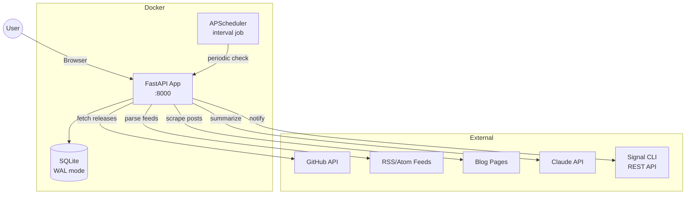
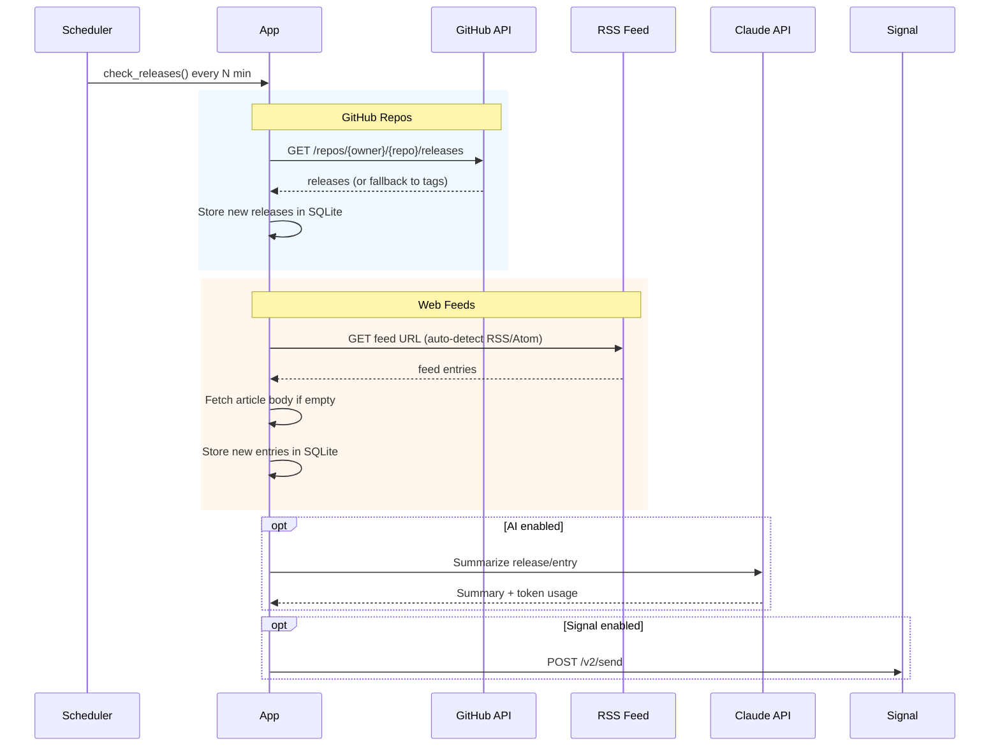

# Release Tracker

Self-hosted web app that monitors software releases from multiple sources — GitHub repositories, RSS/Atom feeds, and blog pages — with optional AI-powered summaries and Signal notifications.


## Features

- **GitHub Releases** — track repos via `owner/repo` or full GitHub URL, with automatic tag fallback for repos without releases
- **Web Feeds** — RSS/Atom auto-detection + optional blog scraping for sites without feeds (e.g. PowerDNS, Proxmox)
- **AI Summaries** — on-demand or automatic release summarization via Claude API (Haiku/Sonnet), with cost tracking
- **Signal Notifications** — push new releases and feed entries to Signal groups or individuals
- **Multi-language UI** — Slovak / English with flag switcher
- **Dark Mode** — system / light / dark theme toggle
- **Auth** — Bearer token for admin actions, public read-only access for everyone
- **Pagination** — infinite scroll with "Load more"

## Architecture



## Data Flow



## Feed Detection

When you add a feed URL, the app automatically:

1. Checks if the URL itself is already an RSS/Atom feed
2. Looks for `<link rel="alternate" type="application/rss+xml">` in page HTML
3. Tries common paths (`/feed/`, `/rss/`, `/atom.xml`, `/rss.xml`, etc.)
4. Falls back to blog scraping (opt-in per feed)

For pages that link to forum threads (e.g. Proxmox announcements → forum), the scraper follows the link and extracts the full post content.

## Quick Start

```bash
cp .env.example .env
# Edit .env with your settings (all optional)
docker compose up --build
```

Open `http://localhost:8000` in your browser.

### Local Development

```bash
python -m venv .venv && source .venv/bin/activate
pip install -r requirements.txt

# Build Tailwind CSS (requires Tailwind CLI binary)
# macOS: curl -sLO https://github.com/tailwindlabs/tailwindcss/releases/latest/download/tailwindcss-macos-arm64 && chmod +x tailwindcss-macos-arm64
# Linux: curl -sLO https://github.com/tailwindlabs/tailwindcss/releases/latest/download/tailwindcss-linux-x64 && chmod +x tailwindcss-linux-x64
./tailwindcss-macos-arm64 -i app/static/input.css -o app/static/style.css --minify

# Run the app
API_TOKEN=your-secret uvicorn app.main:app --reload
```

> **Tip:** During active frontend development, run Tailwind in watch mode in a separate terminal:
> ```bash
> ./tailwindcss-macos-arm64 -i app/static/input.css -o app/static/style.css --watch
> ```

## Configuration

All settings can be configured via environment variables **or** the web UI (Settings tab, requires auth).

UI settings take priority over env vars.

| Variable | Description | Default |
|---|---|---|
| `API_TOKEN` | Bearer token for admin actions (empty = no auth) | — |
| `GITHUB_TOKEN` | GitHub personal access token (higher rate limits) | — |
| `ANTHROPIC_API_KEY` | Claude API key for AI summaries | — |
| `CHECK_INTERVAL_MINUTES` | How often to check for new releases | `60` |
| `SUMMARY_LANGUAGE` | Summary language (`sk` / `en`) | `sk` |
| `SIGNAL_API_URL` | Signal CLI REST API URL | — |
| `SIGNAL_SENDER` | Signal sender phone number | — |
| `SIGNAL_GROUP_ID` | Signal group ID or recipient phone number | — |

## API Endpoints

| Method | Path | Auth | Description |
|---|---|---|---|
| `GET` | `/` | — | Web UI |
| `GET` | `/api/repos` | — | List tracked repositories |
| `POST` | `/api/repos` | ✓ | Add repository |
| `DELETE` | `/api/repos/{id}` | ✓ | Remove repository |
| `GET` | `/api/releases` | — | List releases (paginated) |
| `POST` | `/api/releases/{id}/summarize` | ✓ | Generate AI summary for a release |
| `GET` | `/api/feeds` | — | List tracked feeds |
| `POST` | `/api/feeds` | ✓ | Add feed |
| `PATCH` | `/api/feeds/{id}` | ✓ | Update feed (toggle scraping) |
| `DELETE` | `/api/feeds/{id}` | ✓ | Remove feed |
| `GET` | `/api/feed-entries` | — | List feed entries (paginated) |
| `POST` | `/api/feed-entries/{id}/summarize` | ✓ | Generate AI summary for a feed entry |
| `POST` | `/api/check` | ✓ | Trigger manual release check |
| `POST` | `/api/signal/test` | ✓ | Send test Signal message |
| `GET` | `/api/settings` | ✓ | Get settings |
| `PUT` | `/api/settings` | ✓ | Update settings |
| `GET` | `/api/ai-usage` | ✓ | AI cost tracking stats |
| `GET` | `/api/auth/check` | — | Check if auth is required |

## Stack

| Component | Technology |
|---|---|
| Backend | Python, FastAPI, APScheduler |
| Database | SQLite (WAL mode, aiosqlite) |
| Frontend | Alpine.js, Tailwind CSS (CDN) |
| AI | Claude API (Haiku / Sonnet) |
| Notifications | Signal CLI REST API |
| Deployment | Docker, single container |
