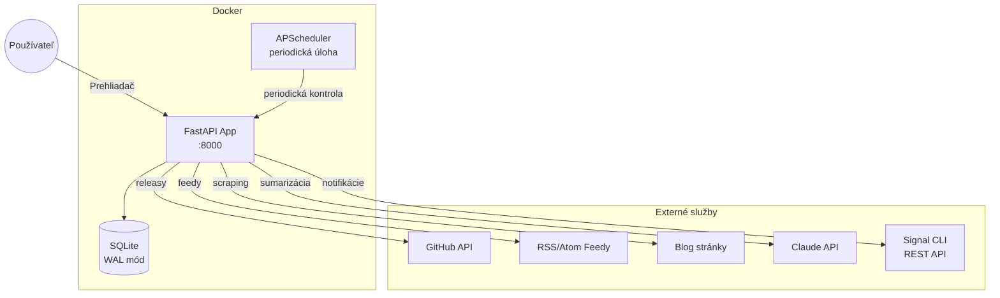
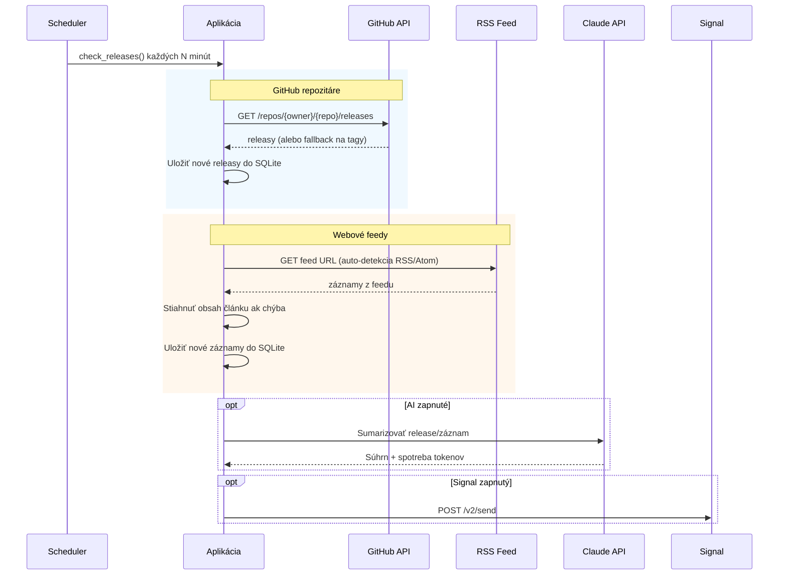

# Release Tracker

Self-hosted webová aplikácia na sledovanie nových verzií softvéru z viacerých zdrojov — GitHub repozitáre, RSS/Atom feedy a blog stránky — s voliteľnými AI súhrnmi a Signal notifikáciami.


## Funkcie

- **GitHub Releases** — sledovanie repozitárov cez `owner/repo` alebo plnú GitHub URL, s automatickým fallbackom na tagy
- **Webové feedy** — automatická detekcia RSS/Atom + voliteľný blog scraping pre stránky bez feedov (napr. PowerDNS, Proxmox)
- **AI súhrny** — manuálna alebo automatická sumarizácia cez Claude API (Haiku/Sonnet), so sledovaním nákladov
- **Signal notifikácie** — push nových releasov a príspevkov do Signal skupín alebo jednotlivcom
- **Viacjazyčné UI** — slovenčina / angličtina s prepínačom vlajkami
- **Tmavý režim** — systém / svetlý / tmavý
- **Autentifikácia** — Bearer token pre admin akcie, verejný read-only prístup pre všetkých
- **Stránkovanie** — "Načítať ďalšie" tlačidlo

## Architektúra



## Tok dát



## Detekcia feedov

Keď pridáte URL feedu, aplikácia automaticky:

1. Skontroluje či samotná URL je RSS/Atom feed
2. Hľadá `<link rel="alternate" type="application/rss+xml">` v HTML stránky
3. Skúsi bežné cesty (`/feed/`, `/rss/`, `/atom.xml`, `/rss.xml`, atď.)
4. Fallback na blog scraping (zapína sa per feed)

Pre stránky, ktoré odkazujú na fórum vlákna (napr. Proxmox oznámenia → fórum), scraper sleduje odkaz a extrahuje celý obsah príspevku.

## Rýchly štart

```bash
cp .env.example .env
# Upravte .env podľa potreby (všetko voliteľné)
docker compose up --build
```

Otvorte `http://localhost:8000` v prehliadači.

### Lokálny vývoj

```bash
python -m venv .venv && source .venv/bin/activate
pip install -r requirements.txt

# Build Tailwind CSS (vyžaduje Tailwind CLI binary)
# macOS: curl -sLO https://github.com/tailwindlabs/tailwindcss/releases/latest/download/tailwindcss-macos-arm64 && chmod +x tailwindcss-macos-arm64
# Linux: curl -sLO https://github.com/tailwindlabs/tailwindcss/releases/latest/download/tailwindcss-linux-x64 && chmod +x tailwindcss-linux-x64
./tailwindcss-macos-arm64 -i app/static/input.css -o app/static/style.css --minify

# Spustenie
API_TOKEN=tajny-token uvicorn app.main:app --reload
```

> **Tip:** Pri aktívnom vývoji frontendu spustite Tailwind vo watch móde v samostatnom termináli:
> ```bash
> ./tailwindcss-macos-arm64 -i app/static/input.css -o app/static/style.css --watch
> ```

## Konfigurácia

Všetky nastavenia sa dajú konfigurovať cez premenné prostredia **alebo** webové rozhranie (záložka Nastavenia, vyžaduje prihlásenie).

Nastavenia z UI majú prednosť pred premennými prostredia.

| Premenná | Popis | Predvolená hodnota |
|---|---|---|
| `API_TOKEN` | Bearer token pre admin akcie (prázdne = bez auth) | — |
| `GITHUB_TOKEN` | GitHub personal access token (vyššie rate limity) | — |
| `ANTHROPIC_API_KEY` | Claude API kľúč pre AI súhrny | — |
| `CHECK_INTERVAL_MINUTES` | Ako často kontrolovať nové releasy | `60` |
| `SUMMARY_LANGUAGE` | Jazyk súhrnov (`sk` / `en`) | `sk` |
| `SIGNAL_API_URL` | URL Signal CLI REST API | — |
| `SIGNAL_SENDER` | Telefónne číslo odosielateľa v Signal CLI | — |
| `SIGNAL_GROUP_ID` | Group ID skupiny alebo telefónne číslo príjemcu | — |

## Stack

| Komponent | Technológia |
|---|---|
| Backend | Python, FastAPI, APScheduler |
| Databáza | SQLite (WAL mód, aiosqlite) |
| Frontend | Alpine.js, Tailwind CSS (CDN) |
| AI | Claude API (Haiku / Sonnet) |
| Notifikácie | Signal CLI REST API |
| Nasadenie | Docker, jeden kontajner |
